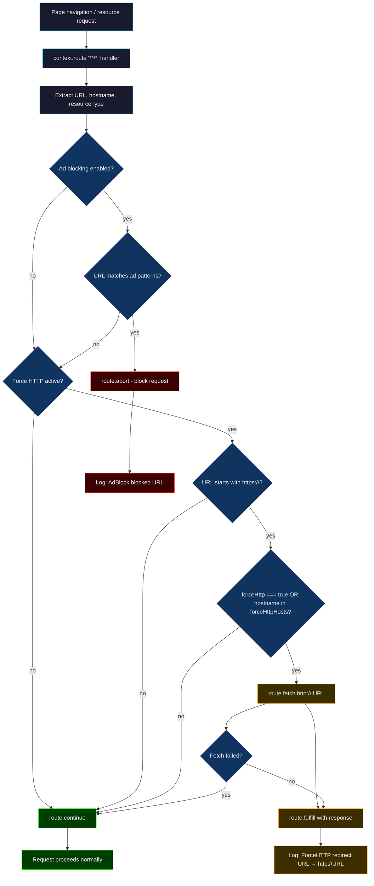

# Request Interception Flow

```mermaid
flowchart TD
    Page[Page navigation / resource request] --> Route[context.route '**/*' handler]

    Route --> Parse[Extract URL, hostname, resourceType]

    Parse --> AdCheck{Ad blocking enabled?}
    AdCheck -->|no| ForceCheck
    AdCheck -->|yes| Match{URL matches ad patterns?}
    Match -->|yes| Abort[route.abort - block request]
    Match -->|no| ForceCheck

    ForceCheck{Force HTTP active?}
    ForceCheck -->|no| Continue[route.continue]
    ForceCheck -->|yes| IsHTTPS{URL starts with https://?}
    IsHTTPS -->|no| Continue
    IsHTTPS -->|yes| ShouldForce{forceHttp === true OR hostname in forceHttpHosts?}
    ShouldForce -->|no| Continue
    ShouldForce -->|yes| Fetch[route.fetch http:// URL]
    Fetch --> Fulfill[route.fulfill with response]
    Fetch --> Fail{Fetch failed?}
    Fail -->|yes| Continue
    Fail -->|no| Fulfill

    Abort --> Log1[Log: AdBlock blocked URL]
    Fulfill --> Log2[Log: ForceHTTP redirect URL → http://URL]
    Continue --> End[Request proceeds normally]

    classDef start fill:#1a1a2e,color:#eee,stroke:#00d4ff
    classDef process fill:#16213e,color:#eee,stroke:#0f3460
    classDef decision fill:#0f3460,color:#eee,stroke:#533483
    classDef block fill:#3d0000,color:#eee,stroke:#ff0000
    classDef redirect fill:#3d2e00,color:#eee,stroke:#ffaa00
    classDef normal fill:#003d00,color:#eee,stroke:#00ff00

    class Page,Route,Parse start
    class AdCheck,ForceCheck,Match,IsHTTPS,ShouldForce,Fail decision
    class Abort,Log1 block
    class Fetch,Fulfill,Log2 redirect
    class Continue,End normal
```
