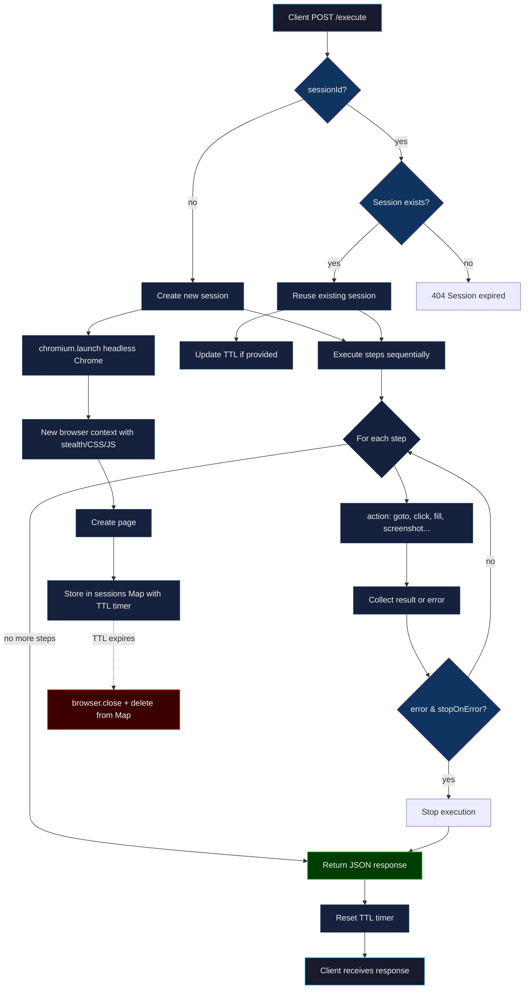

# Session Lifecycle

```mermaid
flowchart TD
    Client[Client POST /execute] --> Check{sessionId?}
    Check -->|yes| Lookup{Session exists?}
    Check -->|no| Create[Create new session]

    Lookup -->|yes| Reuse[Reuse existing session]
    Lookup -->|no| Expire[404 Session expired]

    Create --> Launch[chromium.launch headless Chrome]
    Launch --> Context[New browser context with stealth/CSS/JS]
    Context --> Page[Create page]
    Page --> Store[Store in sessions Map with TTL timer]

    Reuse --> UpdateTTL[Update TTL if provided]

    Create --> Execute
    Reuse --> Execute

    Execute[Execute steps sequentially] --> Step{For each step}
    Step --> Action[action: goto, click, fill, screenshot...]
    Action --> Result[Collect result or error]
    Result --> StopOnError{error & stopOnError?}
    StopOnError -->|yes| Break[Stop execution]
    StopOnError -->|no| Step
    Step -->|no more steps| Response

    Break --> Response[Return JSON response]
    Response --> ResetTTL[Reset TTL timer]
    ResetTTL --> Done[Client receives response]

    Store -.->|TTL expires| Cleanup[browser.close + delete from Map]

    classDef client fill:#1a1a2e,color:#eee,stroke:#00d4ff
    classDef process fill:#16213e,color:#eee,stroke:#0f3460
    classDef decision fill:#0f3460,color:#eee,stroke:#533483
    classDef cleanup fill:#3d0000,color:#eee,stroke:#ff0000
    classDef response fill:#003d00,color:#eee,stroke:#00ff00

    class Client,Done client
    class Create,Launch,Context,Page,Store,Reuse,UpdateTTL,Execute,Step,Action,Result,Response,ResetTTL process
    class Check,Lookup,StopOnError decision
    class Cleanup,Cleanup2 cleanup
    class Response response
```
